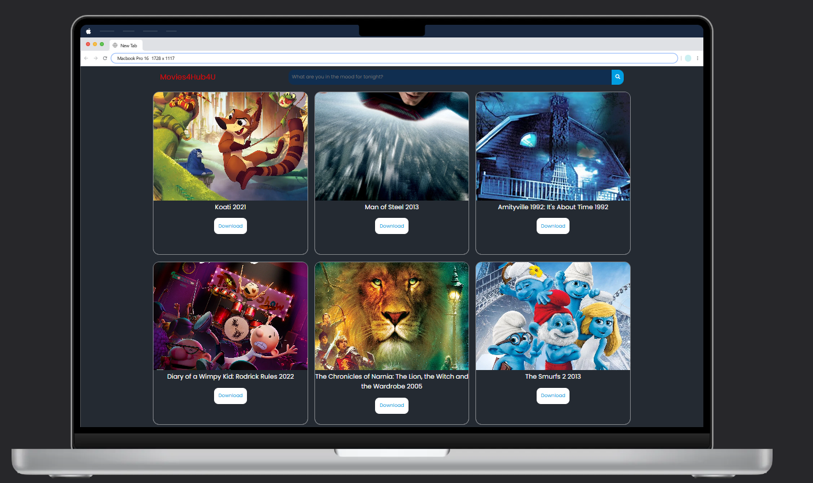
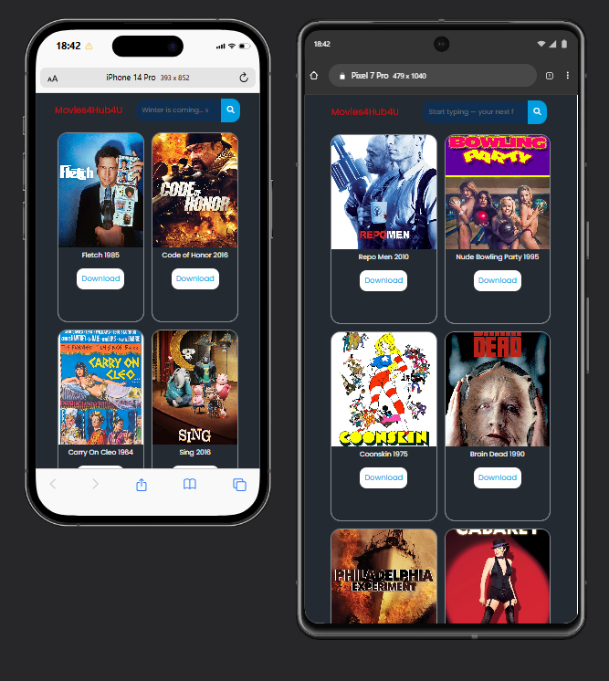

# [Movies4Hub4U](https://movies4hub4u.netlify.app/) 
- Movies4Hub4U is a simple movie search and discovery website built from scratch using **HTML**, **CSS**, and **JavaScript**. This project demonstrates how to fetch and display movie data from public APIs, and provides a clean, responsive UI for users to search for their favorite movies and shows.

## Features

- 🔍 **Search for Movies & Shows:**  
  Instantly search for movies and TV shows using the free IMDB API.

- 🎲 **Random Movies on Home:**  
  On page load, the site displays a random selection of movies using the FrankeyJSON API.

- 📥 **Download Button (Demo):**  
  Each movie card includes a download button (for demo purposes, links to a sample file).

- 💻 **Responsive Design:**  
  Fully responsive layout for desktop and mobile devices.

## APIs Used

- [FrankeyJSON API](https://jsonfakery.com/movies)  
  Used to fetch random movies for the homepage.

- [IMDB Free API](https://imdb.iamidiotareyoutoo.com)
  Used for searching movies and shows by title, actor, or genre.

## How It Works

- The homepage fetches and displays 50 random movies from FrankeyJSON.
- Users can search for any movie or show using the search bar.
- Search results are fetched from the IMDB free API and displayed as cards.
- Each card shows the poster, title, year, and a download button.

## Project Structure

```
movies4hub4u/
│
├── assets/           # Images and static assets
├── index.html        # Main HTML file
├── style.css         # Stylesheet
├── script.js         # Main JavaScript logic
└── README.md         # Project documentation
```

## How to Run

1. **Clone or Download the Repository**
2. Open `index.html` in your browser.
3. Enjoy searching for movies!

> **Note:**  
> The download button is for demonstration and links to a sample file.  
> If you deploy to Netlify or Vercel, make sure all assets are in the correct folders and use direct links for downloads.

## Screenshots

  
  
*Example of the homepage with random movies.*

## Credits

- Movie data: [FrankeyJSON](https://jsonfakery.com/) & [IMDB Free API](https://imdb.iamidiotareyoutoo.com/)
- Icons: [Font Awesome](https://fontawesome.com/)
- UI/UX: Designed and coded by [MaheshJV](https://github.com/MaheshJV9130)

---

**Made with ❤️ using HTML, CSS, and JavaScript**